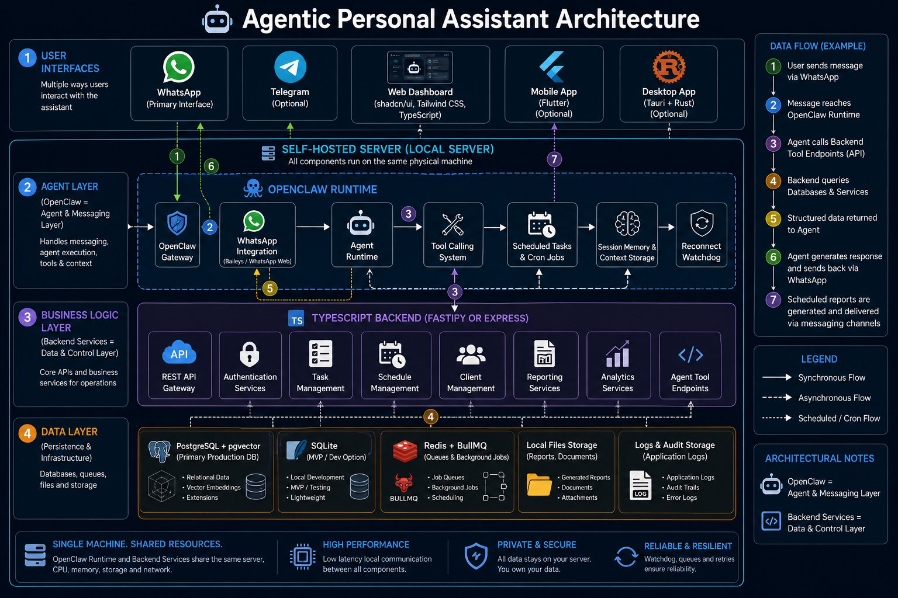

# Nara


Nara is a self-hosted agentic personal assistant platform designed to help manage tasks, schedules, reports, and business workflows from a local office server.

Nara combines a local backend, user-facing mobile/desktop apps, a local web admin dashboard, and an OpenClaw-powered WhatsApp agent layer. The backend stays on a trusted office PC, while the app frontends call its API for daily operations and the admin dashboard stays local to the server machine.

<p style="text-align: center;">
   
</p>

> Project status: Early Development / R&D

## Vision

The goal of Nara is to provide a practical personal assistant that helps reduce operational overhead by combining:

* WhatsApp-first conversational interactions through OpenClaw
* Task and schedule management
* Assistant personality and task setup controls
* Automated reporting
* Business workflow automation
* Agent-driven actions and recommendations

Instead of switching between multiple applications, users can interact with a single assistant that coordinates data, services, and workflows behind the scenes.

---

## Architecture Overview



Nara is built around four primary layers:

### User Interfaces

* Flutter Mobile App (main user-facing app)
* Tauri Desktop App (desktop user-facing app)
* Web Dashboard (local admin dashboard for the office server PC)
* WhatsApp (primary agent conversation channel through OpenClaw)
* Telegram (optional later channel)

### Agent Layer

Powered by OpenClaw Runtime:

* OpenClaw Gateway
* Agent Runtime
* Tool Calling System
* Session Memory & Context Storage
* Scheduled Tasks & Cron Jobs
* Reconnect Watchdog
* WhatsApp Integration (later phase)

### Business Logic Layer

Backend services built with TypeScript:

* Fastify or Express APIs
* Authentication Services
* Task Management
* Schedule Management
* Client Management
* Reporting Services
* Analytics Services
* Agent Tool Endpoints

### Data Layer

* PostgreSQL + pgvector
* Redis + BullMQ
* SQLite (Development / MVP)
* Local File Storage
* Reports & Logs

---

## Deployment Model

Nara is intended to run on one office PC or local server:

* Backend API runs locally on the server machine.
* PostgreSQL + pgvector and Redis run on the same machine or local network.
* Flutter mobile app and Tauri desktop app are the user-facing frontends.
* Web dashboard is the local admin surface for setup, diagnostics, logs, and server operations on the office PC.
* Mobile and desktop apps connect to the backend API over the office network or Cloudflare Tunnel.
* No public web domain is required for the dashboard surface.
* Railway/VPS deployment remains a later option if the project outgrows the office-server model.

---

## Core Workflow

1. User works from the mobile app, desktop app, or WhatsApp conversation.
2. Client app calls the backend API.
3. Backend services query databases and business systems.
4. Backend returns structured operational data to the client.
5. Agent workflows can invoke backend tool endpoints for automated work.
6. Scheduled reports and reminders can run without direct user interaction.
7. WhatsApp messages go through OpenClaw before invoking the same backend tools.

The backend remains the source of truth whether the request comes from desktop, mobile, scheduled jobs, or a future messaging channel.

---

## Key Principles

* Self-hosted by default
* Separate user app frontend and local admin web dashboard
* Local-first desktop and mobile experience
* Agent and backend services can run on the same server
* Clear separation between AI orchestration and business logic
* Backend remains the source of truth
* Extensible tool-based architecture
* Designed for automation and operational efficiency

---

## Technology Stack

### Agent Layer

* OpenClaw
* WhatsApp Web / Baileys (later phase)

### Backend

* TypeScript
* Fastify / Express

### Frontend

* TypeScript
* shadcn/ui
* Tailwind CSS
* Tauri
* Flutter

Frontend workspace split:

* `apps/backend`: source of truth API for mobile, desktop, admin, and agent tools.
* `apps/web-admin`: local admin dashboard for the office server PC.
* `apps/desktop-app`: desktop app frontend prototype for user-facing workflows.
* `apps/mobile-app`: Flutter mobile app for the main user-facing experience.

### Database & Infrastructure

* PostgreSQL
* pgvector
* Redis
* BullMQ
* SQLite (optional)

---

## Local Development

Copy the example environment file and fill the local secrets:

```powershell
Copy-Item .env.example .env
```

Set `OPENCLAW_GATEWAY_TOKEN` from `gateway.auth.token` in:

```text
C:\Users\<username>\.openclaw\openclaw.json
```

Start PostgreSQL + pgvector and Redis with Docker:

```powershell
npm run infra:up
```

This starts local containers on the same ports used by `.env`:

* PostgreSQL: `localhost:5432`
* Redis: `localhost:6379`

If Redis or PostgreSQL is already running from WSL or another local service on those ports, stop that service first before starting Docker.

Apply the database schema:

```powershell
npm run db:push
```

Start the backend, local admin dashboard, and app frontend:

```powershell
npm run dev
```

Open the local admin dashboard at:

```text
http://localhost:5173
```

Open the desktop app frontend prototype at:

```text
http://localhost:5174
```

Run the Flutter mobile app from its project folder:

```powershell
cd apps/mobile-app
flutter run
```

The mobile app defaults to the current Nara backend tunnel:

```text
https://narabot.web.id
```

Development builds can still override the backend URL explicitly:

```powershell
flutter run --dart-define=NARA_API_BASE_URL=http://192.168.x.x:4000
```

The mobile app has been smoke-tested on a physical Android device through wireless debugging. If `flutter run` cannot find the project, make sure the command is executed from `apps/mobile-app`, not the monorepo root.

Log in with the local operator credentials from `.env`:

```text
OPERATOR_USERNAME
OPERATOR_PASSWORD
```

The dashboard reads:

* `GET /health`
* `GET /api/readiness`
* `GET /api/tasks`
* `POST /api/tasks`
* `PATCH /api/tasks/:id/complete`

Task endpoints require authentication. Normal mobile users receive only their own tasks, while the local operator dashboard sees global/admin tasks by default.

Use `/health` for Cloudflare Tunnel checks, uptime checks, and app connectivity tests. Use `/api/readiness` for detailed dependency status; it can be degraded when OpenClaw is not reachable while the backend API is still running.

## Windows Server Setup

For preparing an office PC as the Nara server, use the Windows runbook:

```text
ops/windows/README.md
```

It covers the repeatable setup path for:

* Docker services for PostgreSQL and Redis
* backend/admin process management on Windows
* Cloudflare Tunnel routing to the backend
* OpenClaw WhatsApp setup, self-phone development mode, and server migration notes
* `start-nara-server.ps1` and `check-nara-health.ps1` for daily server operation

The helper scripts in `ops/windows` intentionally do not commit secrets, Cloudflare tunnel tokens, OpenClaw config, or WhatsApp linked-device credentials.

Backend structured logs are written as newline-delimited JSON:

```text
.tmp/logs/backend.ndjson
```

Set `BACKEND_LOG_DIR` to move logs to a different local folder on the office server.

Mobile authentication endpoints:

* `POST /api/auth/register`
* `POST /api/auth/user-login`
* `GET /api/auth/me`

Identity and Nara Bot access endpoints:

* `GET /api/users`
* `POST /api/users`
* `POST /api/users/:id/contacts`
* `GET /api/users/:id/assistant-profile`
* `PUT /api/users/:id/assistant-profile`
* `POST /api/users/:id/agent-access`
* `GET /api/users/:id/agent-access`
* `GET /api/agent-access`
* `PATCH /api/agent-access/:id`

These endpoints store user WhatsApp access intent in Nara's database. OpenClaw allowlist sync is intentionally behind a future service/worker boundary.

Reminder endpoints:

* `GET /api/reminders`
* `GET /api/reminders/execution`
* `POST /api/reminders/process-due` (operator only)
* `GET /api/reminders/:id`
* `POST /api/reminders`
* `PATCH /api/reminders/:id`
* `DELETE /api/reminders/:id`

Reminder records are scoped to the signed-in mobile user. One-time reminders use `scheduledAt`; recurring reminders use a cron expression and timezone. The backend worker records due reminders, disables completed one-time reminders, advances supported recurring schedules, and writes `reminder.triggered` audit events. Actual delivery through WhatsApp, push, or local notifications remains a follow-up milestone.

Backup uses `BACKUP_DIR` for local backup files. Database export tries host `pg_dump` first and falls back to `docker exec` with `POSTGRES_CONTAINER_NAME`, which defaults to the Docker Compose container name:

```text
nara-postgres-1
```

Test the agent tool endpoints without WhatsApp:

```powershell
npm run agent:smoke
```

The smoke test creates a temporary user when `--user-id` is not provided, exercises the user-scoped task and reminder lifecycles, reads a summary, and can clean up the generated records.

To test an existing user or delete the smoke-test task after the run:

```powershell
npm --workspace @nara/backend run agent:smoke -- --user-id <user-uuid>
npm --workspace @nara/backend run agent:smoke -- --cleanup
```

Useful checks:

```powershell
docker compose ps
docker exec nara-postgres-1 pg_isready -U nara -d nara_db
docker exec nara-postgres-1 psql -U nara -d nara_db -c "\dt"
```

Stop PostgreSQL when not needed:

```powershell
npm run infra:down
```

---

## Remote Access

For access outside the office network, use Cloudflare Tunnel to expose only the backend API:

```text
Cloudflare Tunnel URL -> http://127.0.0.1:4000
```

Do not expose PostgreSQL or Redis. Keep them local to the server PC.

Remote mobile and desktop apps should store a configurable server URL, for example:

```text
https://your-tunnel-hostname.example.com
```

See [Cloudflare Tunnel Deployment](docs/deployment/cloudflare-tunnel.md) for the deployment model and security checklist.

---

## Roadmap

See [Nara UI/UX Brief](docs/design/ui-ux-brief.md), [App Frontend UX Spec](docs/design/app-frontend-spec.md), [Web Admin UX Spec](docs/design/web-admin-spec.md), and [Visual System Baseline](docs/design/visual-system.md) for the current frontend split, screen map, and implementation-ready design baseline.

See [ADR 003](docs/adr/003-identity-and-whatsapp-allowlist.md) for the identity, WhatsApp contact, and Nara Bot allowlist model.

See [Mobile App Notes](docs/mobile-app.md) for Flutter run commands, device testing notes, and next mobile work.

### Implementation Plan

1. Harden backend access before exposing it outside the office network:
   operator auth, protected write endpoints, admin auth, rate limiting, and audit logs.
2. Keep the office PC as the server:
   PostgreSQL and Redis stay local, backend runs on the server PC, and Cloudflare Tunnel exposes only the backend API.
3. Make every client build-configurable:
   mobile and desktop apps should use the Nara backend tunnel by default while still allowing development overrides.
4. Build two frontend tracks:
   user-facing app frontend for mobile/desktop, and local web admin dashboard for the office server PC.
5. Add agent workflows after the core app is stable:
   OpenClaw tool expansion, confirmation flow, memory/context storage, reports, and schedules.
6. Prioritize the OpenClaw WhatsApp agent as the main product selling point:
   WhatsApp first when the assistant phone number is ready, Telegram only if useful later.

### Phase 1: Local Backend Foundation

* [x] Monorepo scaffold
* [x] PostgreSQL + pgvector Docker setup
* [x] Redis connection support
* [x] Task schema and initial migration
* [x] Protected agent tool endpoints
* [x] Local agent smoke test without WhatsApp
* [x] Backend readiness checks for database, Redis, and OpenClaw
* [x] Backend operator authentication
* [x] Protect write endpoints
* [x] Admin/dashboard authentication

### Phase 2: Remote Access and Security

* [x] Backend operator authentication
* [x] Protect write endpoints
* [x] Admin/dashboard authentication
* [x] Build-time backend URL configuration for mobile clients
* [x] Cloudflare Tunnel setup for backend API
* [ ] Rate limiting for exposed endpoints
* [x] Document backup and recovery basics

### Phase 3: Operational Core

* [x] Task management CRUD
* [x] User-scoped task ownership for mobile app data
* [x] User-scoped reminder and schedule CRUD
* [ ] Reminder worker with Redis/BullMQ
* [ ] Reporting service
* [ ] Client/contact management
* [x] Basic user registration and mobile login
* [ ] Role-aware user access control beyond the MVP auth gate
* [x] User WhatsApp contact and Nara Bot allowlist model
* [x] Audit logs foundation for identity and access changes
* [x] Audit logs for agent-triggered reminder actions

### Phase 4: Mobile App

* [x] Flutter app scaffold
* [x] Backend API connection settings
* [x] Login and register screen backed by database users
* [x] Persist mobile backend URL and user session across app restarts
* [x] Mobile shell with Home, Tasks, Reminders, Nara, and Me
* [x] Shared mobile connection state with automatic and pull-to-refresh checks
* [x] Mobile task create and complete actions
* [x] Mobile task priority, due date, and Today/Open/Done grouping
* [x] Mobile reminder create, list, pause, resume, delete, and pull-to-refresh
* [x] Personality and assistant setup screen with persisted local preferences
* [x] WhatsApp number and Nara Bot access request screen
* [x] Home Nara Bot status backed by user contact and agent access data
* [ ] Push or local notification strategy
* [ ] Approval screen for agent-triggered actions

### Phase 5: Desktop App

* [ ] Tauri desktop shell
* [ ] Shared app feature parity with mobile where practical
* [ ] Backend API connection settings
* [ ] Personality and assistant setup screens
* [ ] Desktop task and schedule screens

### Phase 6: Web Admin Panel

* [x] Local admin dashboard authentication (completed in Phase 2)
* [x] System health and logs (Health + Logs screens)
* [x] Tool endpoint debugging (Agent Tools screen)
* [x] Users and WhatsApp access API foundation
* [x] Users and WhatsApp access management UI (Users + WhatsApp Access screens)
* [x] Logs backend integration from audit events
* [x] WhatsApp Access joined user/contact data
* [x] Server configuration checks (Config screen)
* [x] Local backup/export controls and backend MVP
* [x] Open source attribution section

> **Note:** Phase 6 admin dashboard is complete for MVP. Backup restore and scheduled backup automation remain later hardening work.

### Phase 7: Agent Automation

* [x] Expand OpenClaw tool definitions with user context and scoped task tools
* [x] Backend assistant profile for user-specific agent personality
* [x] No-WhatsApp agent smoke test with user-scoped task lifecycle
* [x] User-scoped reminder tools and smoke-test lifecycle
* [ ] Scheduled report generation
* [ ] Agent-safe confirmation flow for destructive actions
* [ ] Memory/context storage for business workflows

### Phase 8: Messaging Channels

* [ ] WhatsApp integration
* [ ] Nara Bot allowlist sync with OpenClaw
* [ ] Telegram integration (optional)
* [ ] Messaging delivery for reminders and reports

---

## License

TBD
